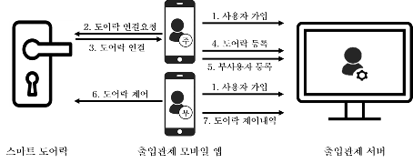
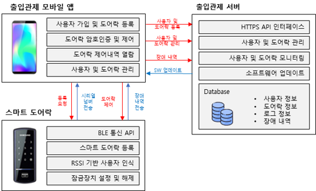
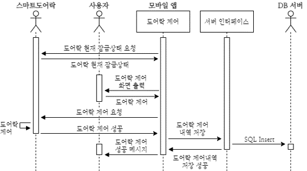
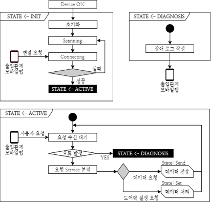
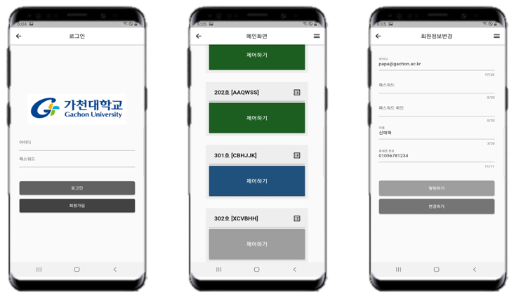
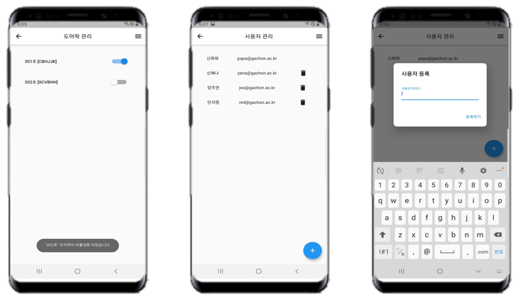
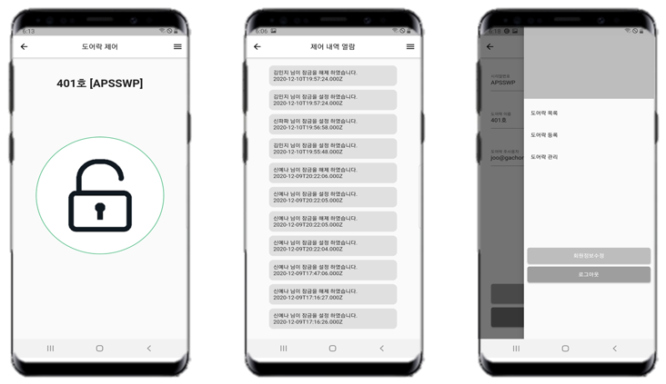
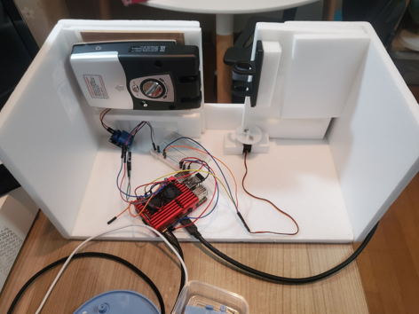

# BLE 기반의 비접촉 모바일 도어락 제어 시스템
- [스마트 도어락](/doorlock):
  
  
- [출입관제 모바일 앱](/app):
  
- [출입관제 서버](/server):
  
  
- [관리자 모니터링 웹](/server/doorlock/view):
  
  
  
  

## 연구의 필요성
- 접촉의 위험성
  - 현재 포스트 코로나로 인해 일상에서 언택트가 지속되고 비접촉의 삶이 중요함.
  - 출입제어 시스템은 특정 공간의 선별적 출입을 통해 인간의 생활공간을 보장함.
  - 기존의 출입제어 시스템인 핀번호 입력과 지문인식은 접촉의 위험성이 있음.
- BLE(Bluetooth Low Energy)기반의 출입제어 시스템
  - 소모 전력이 적으며 대부분의 스마트폰에 탑재되어 있는 저전력 블루투스 기술인 BLE(Bluetooth Low Energy)를 이용하고자 함.
  - 기존의 BLE 기반 출입제어 시스템은 대규모의 인원이 이용하기에 제한적.
  - 따라서 관리자와 사용자 사이에 중간 관리자를 두어 대규모 인원의 출입제어를 안전하게 통제하고자 함.

## 서비스 시나리오

- 출입제어 시스템은 [스마트 도어락](/doorlock), [출입관제 모바일 앱](/app), [출입관제 서버](/server)로 이루어짐.
- **사용자**가 모바일 앱에서 스마트 도어락을 원격으로 제어하기 위해서는 도어락 등록과정이 필요.
- 출입관제 서버는 사용자 및 도어락 등록 요청을 처리한다.
- **관리자**는 출입관제 서버에서 도어락 제어내역을 전달받아 도어락과 모바일 앱을 모니터링.
- 도어락과 도어락 사용자를 관리하기 위해 중간 관리자인 **주사용자**를 도입.
- **주사용자**는 도어락을 등록하며, 가입 된 사용자를 도어락 부사용자로 추가한다.

## 시스템 구성도

- 출입관제 모바일 앱과 스마트 도어락은 BLE 통신으로 연결됨.
- 출입관제 모바일 앱은 *BLE 통신*을 통해 원격으로 스마트 도어락을 제어.
- 출입관제 모바일 앱에서의 요청은 *HTTP 통신*을 통해 출입관제 서버에서 처리.
- 스마트 도어락과 출입관제 모바일 앱의 로그 및 장애 내역은 출입관제 모바일 앱을 통해 출입관제 서버로 전송됨.
- 출입관제 서버에서는 로그 및 장애내역을 모니터링.

## 도어락 잠금제어 과정

- 모바일 앱은 도어락으로부터 현재 잠금 상태를 전달받아 모바일 앱 화면에 출력.
- 사용자는 잠금 설정 및 해제 명령을 하고 모바일 앱은 도어락으로 해당 명령을 요청.
- 도어락은 요청에 따라 도어락의 잠금을 제어하고 성공 여부 메시지를 모바일 앱으로 반환.
- 성공 시 서버에 도어락 잠금제어 내역을 저장하고 서버는 요청을 처리한 뒤 성공 여부 메시지를 반환.

## 스마트 도어락 상태

- 도어락의 state는 init state, active state, diagnosis state로 나눔.
- **init state**: 디바이스를 작동시킨 후 최초 상태로 초기화를 진행한 뒤 블루투스 통신을 연결하며, 연결에 성공하면 active state로 전환.
- **active state**: 모바일 앱의 요청을 처리하는 부분이며 데이터 전송 요청과 데이터 처리 요청으로 나눔.
- 데이터 전송 부분에서는 모바일 앱으로 현재 도어락의 잠금 여부 값을 전송하며, 데이터 처리 부분에서는 모바일 앱의 도어락 제어 요청에 따라 도어락 잠금을 설정 및 해제.
- **diagnosis state**: 요청 처리 중 장애가 발생했을 경우, diagnosis 상태로 전환. 장애 로그를 작성하며 모바일 앱과 블루투스 통신이 연결되었을 때 장애 내역을 전송.

## 출입관제 모바일 앱

  
  
  

## 스마트 도어락

- 라즈베리파이4, 자동개폐기, Relay스위치, 서보모터, LED센서, 부저센서를 이용하여 구현.
- 출입문의 잠금은 자동개폐기를 이용하며, 자동개폐기에 전기 흐름을 제어하기 위해 Relay스위치와 연결.
- 출입문의 개폐는 서보모터에 피니언을 부착한 뒤 회전시켜 제어.
- 출입문의 개폐를 시각적, 청각적으로 알리기 위해 LED센서와 부저센서를 사용.
- 출입관제 모바일 앱과의 BLE 연결을 통해 등록 및 제어
